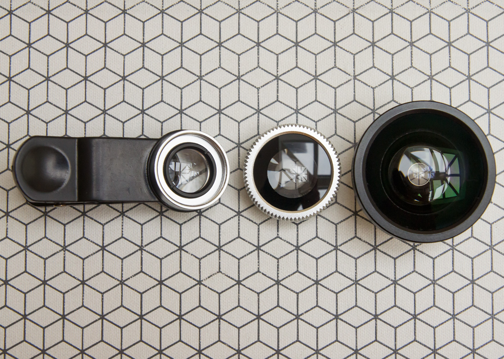
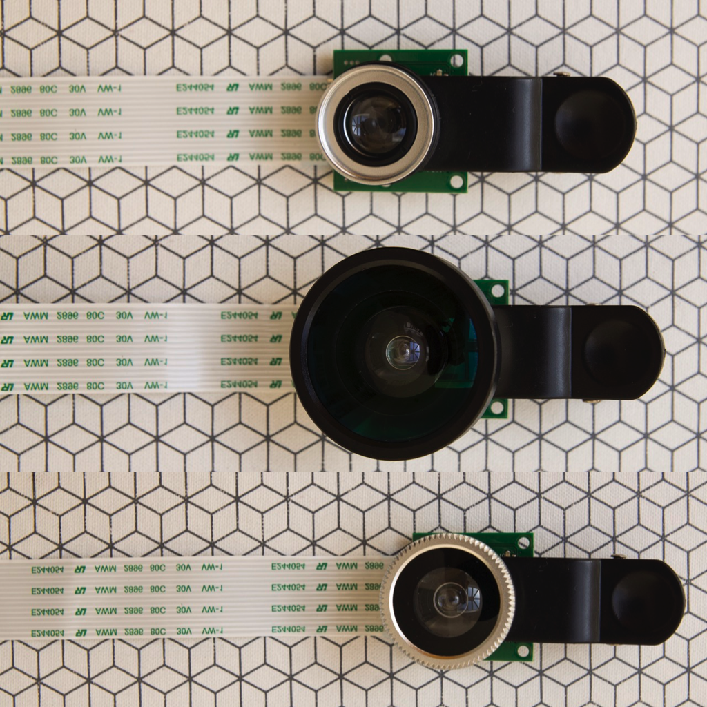

## Raspberry Pi camera lenses

This short guide will show describe how to use the set of three camera lenses,
available in the Pimoroni shop, with the Raspberry Pi camera.

As you'll see in the photo below, there are three lenses, although when you
first open the box, the fisheye lens will be screwed onto the macro lens. I'll
explain how to setup the different lenses below.



The lenses just clip over the Raspberry Pi camera board. You might want to
fiddle about with the placement of the lens to get it just the way you want.

## Lens setups

The three different lens setups are shown below.



Topmost is the **macro lens**. As the lenses come in the box, the fisheye lens is
screwed onto the macro lens, so you'll need to unscrew it first to use the
macro. The macro lens is ideal for really close up photos, with a focal length
of about 5 cm. You'll see some examples of images from the macro lens below.

In the centre is the **wide angle lens**. To use this one, you'll need to unscrew
the macro lens first and then screw on the wide angle. It can be used to get a
really wide field of view and is perfect for something like a CCTV camera. The
field of view should be close to 180 degrees.

At the bottom is the **fisheye lens**. The fisheye is used in combination with
the macro lens and needs to be screwed on top of it. It's more of a novelty
lens, distorting and warping the image at the centre, hence the name fisheye.

## Setting the camera up

You'll need to connect the camera to your Raspberry Pi with the ribbon cable,
plugging it into the CSI connector on the Pi. If it doesn't work first time,
the cable is probably the wrong way round; just turn it round and it should
work.

You'll also need to enable the camera in the `raspi-config`. To do this, open
a terminal and type `sudo raspi-config`. Select `Enable camera`, then enter,
then select `Finish`. It'll ask if you want to reboot and, once you do, the
camera should be enabled.

To take a still picture, in the terminal, type the following:

```bash
raspistill -o mypicture.jpg
```

Of course, you can also record video, by typing the following:

```bash
raspivid -o myvideo.h264
```

This will record a 5 second video be default, but you can specify the time with,
for example, `-t 10000`, which will record for 10,000 milliseconds, or 10
seconds.

Full instructions on using the Pi camera can be found
[here](https://www.raspberrypi.org/documentation/usage/camera/README.md).

## Examples

The quality of images from these lenses is remarkably good. Here are some macro
images that I took, below, of some wool and one of the Pimoroni HATs. All that's
been done to the images below is some sharpening and white balance correction,
as the Pi camera sometimes has a bit of a strange colour cast.


